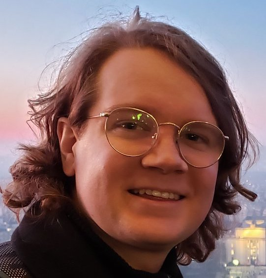

---
# the default layout is 'page'
icon: fas fa-id-card
order: 1
---

## Jack R. Crewse III

*Postdoctoral Appointee*  
*Center for Nanoscale Materials - Argonne National Laboratory*  
  
<i class="fa fa-map-marker"></i> Oak Park, IL  
<i class="fa fa-envelope"></i> [jcrewseiii@gmail.com](mailto:jcrewseiii@gmail.com)

## Professional Interests
My career has been characterized by a synergy between my fascination with the laws of nature and the computing technology that has allowed us to better understand them. These two sides of my professional identity coalesced for the first time during graduate school where I leveraged high-performance computing systems to study some of nature's most interesting phenomenon. My doctoral dissertation investigated the effects of disorder on superconductor-insulator transitions and explored the condensed matter equivalent of the Higgs Boson in superfluids via large-scale quantum Monte Carlo simulations. While visiting a research group at the University of Regensburg, I developed simulations of the light-matter interaction of terahertz lasers with topological materials. Currently, as a postdoctoral researcher, I utilize the plethora of high-performance computing resources at Argonne to simulate the optical properties of innovative nanostructures with helical symmetry, utilizing density-functional theory techniques. 

Moving 